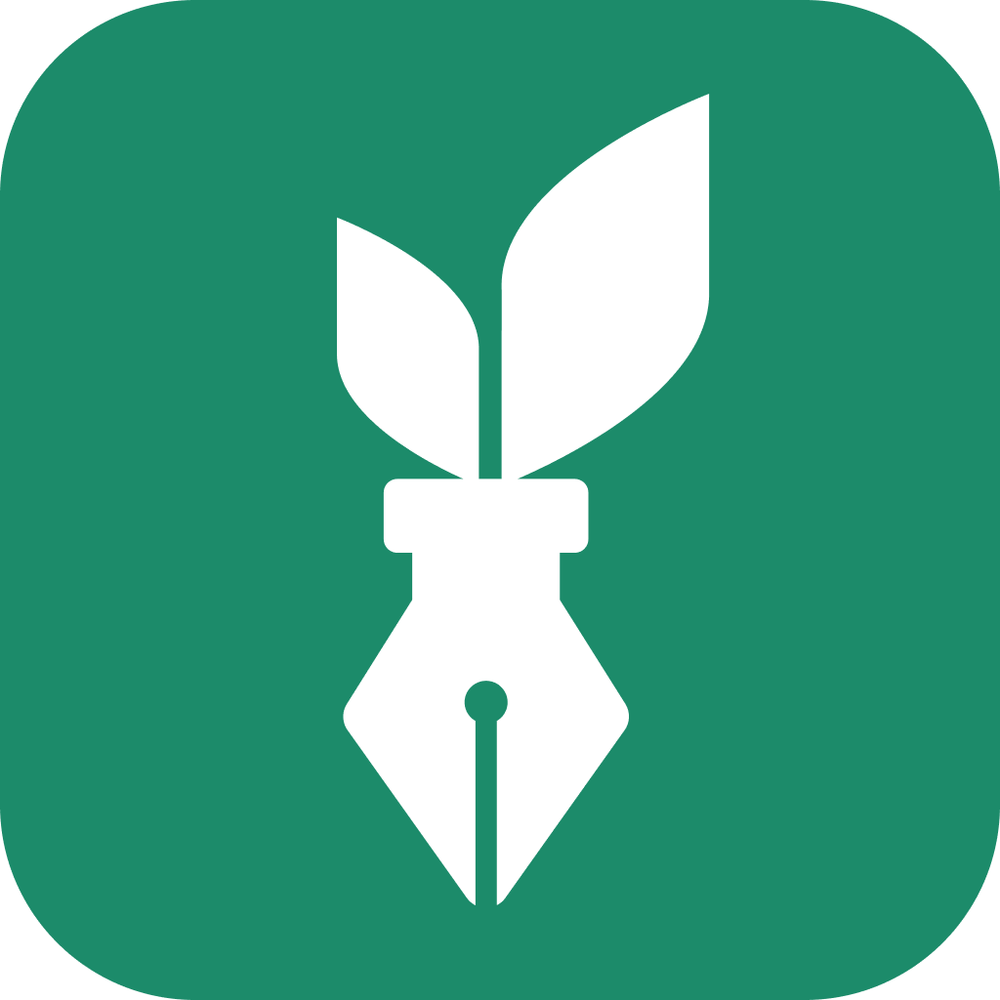

<p align="center"></p>

# Green-Sign(小綠簽)

An e-signature PWA(Progressive Web App) that allows users to create a personalized, handwritten signature and merge it with a PDF document.

## Demo

[Visit the live PWA site](https://johncena-huang.github.io/green-sign/)

## Installation

Install the dependencies

```bash
  yarn
# or
  npm install
```

Start the app in development mode (hot-code reloading, error reporting, etc.)

```bash
quasar dev
```

Build the app for production

```bash
quasar build
```

## Core Dependencies

- [Quasar](https://quasar.dev/): used for building PWA and its in-built UI components, utilities to speed up the developement process.
- [PDF.js](https://mozilla.github.io/pdf.js/): used for rendering the pdf document in the browser and dealing with page switching, zooming.
- [Fabric.js](http://fabricjs.com/): used for setting the image as the background of the canvas, appending new elements(such as images or text) on top of it, making these elements easily movable and resizable with the customizable built-in controls.
- [jsPDF](https://github.com/parallax/jsPDF): used for pdf file generation in the browser based on the merged canvas images, which can be downloaded for the user.
- [Dexie.js](https://dexie.org/): used for its simplified, user-friendly interface(promise-based) to work with IndexedDB in the browser as the means to store, retrieve the usage records in the browser.
- [Vue3-lottie](https://github.com/megasanjay/vue3-lottie): used for its easy-to-use interface to work with Lottie animations(JSON-based animation format)

## Acknowledgements

- [The F2E](https://2022.thef2e.com/): An annual event held by [HexSchool](https://www.hexschool.com/) in Taiwan which brings together UI/UX designers and web developers to collaborate on creating interesting, high-quality web applications.
- [Doris KT](https://www.figma.com/file/6ZjDFQSrwRy6OUAXDmJNhz/%E5%B0%8F%E7%B6%A0%E7%B0%BD?node-id=0%3A1&t=lVWygfSndZULzFO9-0): The UI/UX designer for the application.
